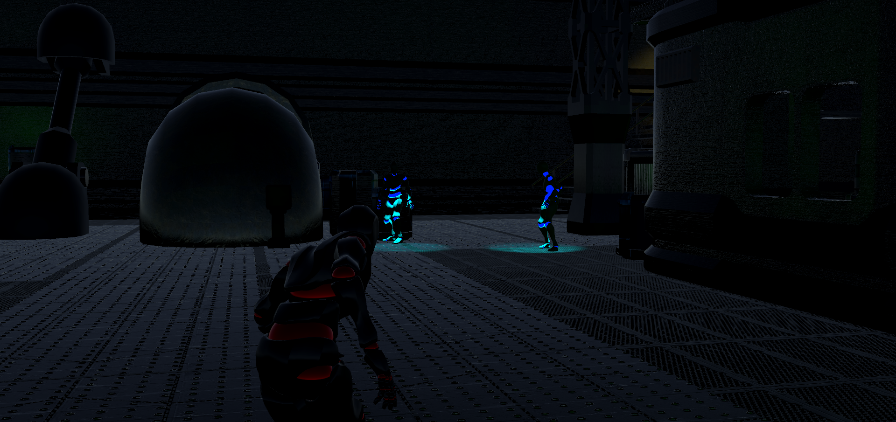
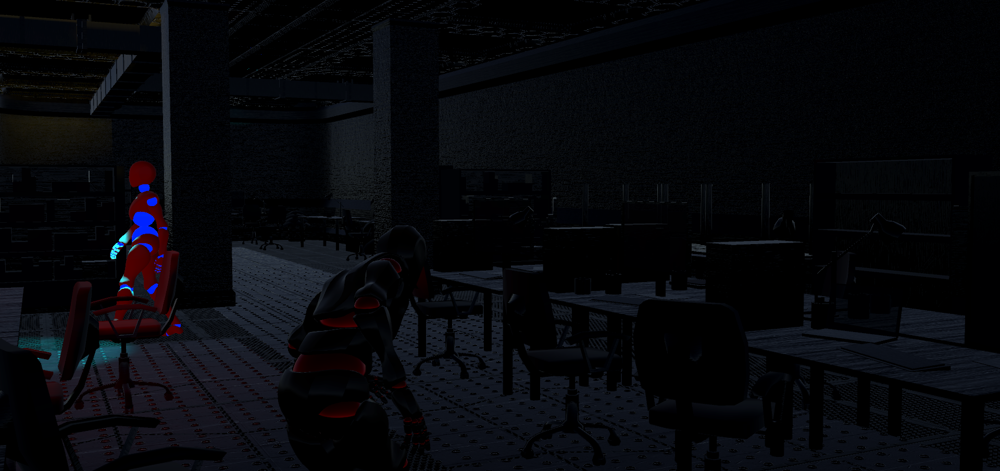
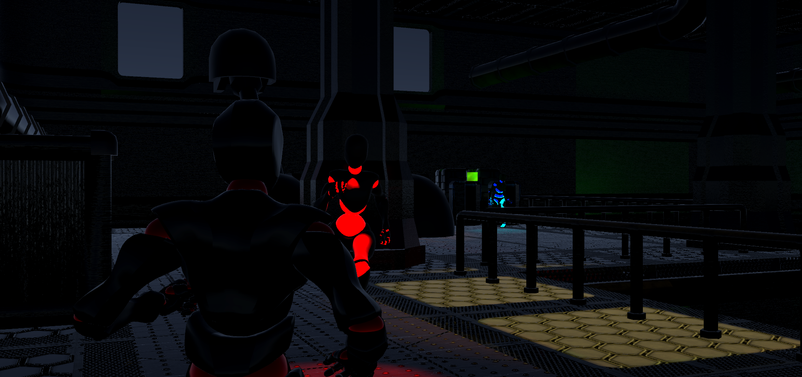
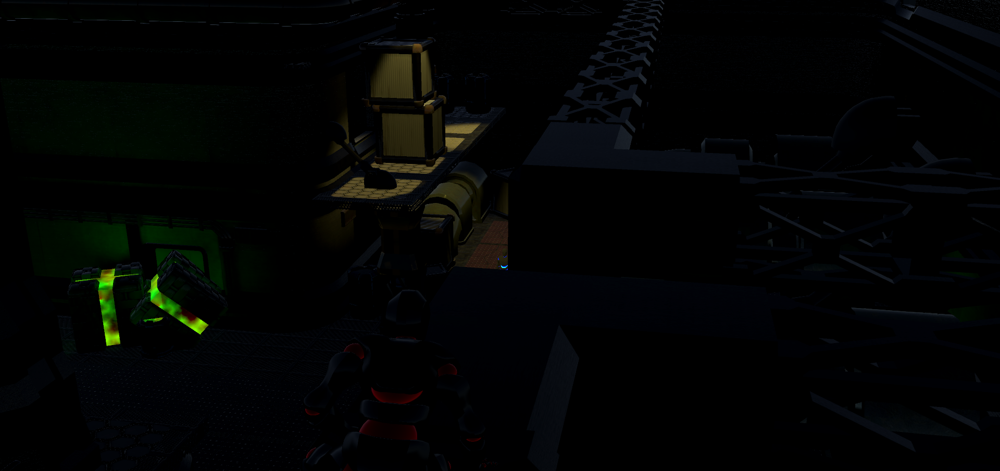

# 3DInfiltration

This game is a 3D infiltration game. 
In this game, the player must avoid alerting the guards as he doesn't have a single mean of defending himself.

The player will be able to crouch to reduce the chance of being detected and jump to climb on some crates.
The level was built using Unity SNAPS prototyping assets. The animations are from https://www.mixamo.com/#/.

Every guard has a blue light located in front of them which helps the player know more or less their detection range.
Some of them covers the area just by standing still while some others are patrolling around.
Once the player is detected, the guard who detected him will start chasing the player and his spotlight will turn red.
His sole option at this point will be to flee until the guard can't find him anymore.

